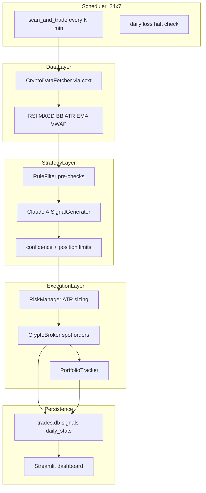
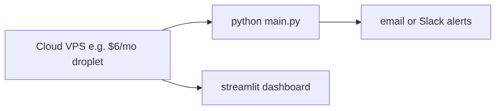

# Crypto AI Daytrading Bot — Build Plan

## Current state

- **This repo** implements the full spot-trading bot (Phases 0–8 complete).
- Sibling project [botbought](https://github.com/caleblummer/botbought) is the equities reference — scheduler, indicators, Claude AI signals, rule filters, risk manager, SQLite persistence, Streamlit dashboard, backtesting, and paper/live guards.

The implementation **ports that architecture** — swapping the Alpaca equities layer for a crypto exchange adapter via [ccxt](https://github.com/ccxt/ccxt).

### Implementation status

| Phase | Description | Status |
|---|---|---|
| 0 | Project scaffold | Done |
| 1 | Data + indicators | Done |
| 2 | AI signal layer | Done |
| 3 | Rule filters + risk | Done |
| 4 | Execution layer | Done |
| 5 | Bot loop + scheduling | Done |
| 6 | Persistence + dashboard | Done |
| 7 | Backtesting | Done |
| 8 | Safety scripts + tests | Done |
| 9 | Paper trading validation (2+ weeks) | **In progress** |
| 10 | Live trading | Not started |

---

## Recommended exchange: ccxt + Binance (spot first)

Start with **ccxt** as the exchange abstraction and **Binance spot** as the default backend:

| Why ccxt | Why Binance spot first |
|---|---|
| One API surface for Binance, Coinbase, Kraken, etc. | Deepest liquidity on major pairs (BTC/USDT, ETH/USDT) |
| Easy to swap exchanges later without rewriting the bot | Mature testnet for paper trading |
| Well-documented OHLCV, order book, balance, order APIs | Bracket/OCO order support for stop-loss + take-profit |

**US users:** If you're US-based and Binance.com is unavailable, swap the ccxt exchange ID to `coinbase` or `kraken` in config — the rest of the bot stays the same.

**Alpaca Crypto** is possible (you may already have Alpaca keys from `botbought`) but has thinner pair coverage and less crypto-native features (funding rates, perpetuals). Better as a later option, not the primary target.

---

## High-level architecture



This mirrors `botbought/main.py` but replaces market-hours scheduling with **24/7 crypto scheduling** and removes equities-only logic (T+1 settlement, earnings calendar).

---

## What changes from `botbought` vs what stays

### Keep (port with minimal changes)

| Module | Source | Notes |
|---|---|---|
| Bot orchestrator loop | `main.py` | Remove 09:35–15:44 ET window; optional daily close via `DAILY_CLOSE_UTC` |
| AI signal generation | `strategy/ai_signal.py` | Crypto-tuned system prompt (24h volatility, no earnings) |
| Rule filters (concept) | `strategy/rules.py` | Drop earnings filter; add spread/liquidity thresholds per pair |
| Risk manager | `risk/manager.py` | ATR stops, 2% risk/trade, daily loss halt |
| SQLite schema | `db/database.py` | `market_type` column for future futures support |
| Dashboard | `dashboard/app.py` | Pairs instead of tickers |
| Logging | `logs/logger.py` | Direct port |
| Integration test pattern | `tests/test_integration.py` | Mock ccxt instead of Alpaca |

### Replace (crypto-specific)

| Old (equities) | New (crypto) |
|---|---|
| `AlpacaBroker` | `CryptoBroker` via ccxt — spot market/limit orders, OCO for bracket exits |
| `MarketDataFetcher` (Alpaca + yfinance) | `CryptoDataFetcher` — ccxt `fetch_ohlcv`, `fetch_ticker`, order book |
| `config/watchlist.py` (AAPL, NVDA…) | `BTC/USDT`, `ETH/USDT`, `SOL/USDT`, etc. |
| T+1 settlement check | Remove — crypto spot settles instantly |
| Earnings calendar filter | Remove — replace with optional funding-rate filter (futures phase) |
| 15:45 ET EOD close | Configurable: optional daily close at UTC midnight, or hold overnight |
| VWAP (session-based) | Rolling 24h VWAP |

### Design for futures (phase 2, not built yet)

- Abstract `BrokerInterface` with `SpotBroker` and `FuturesBroker` implementations
- Add `market_type: spot | futures` to settings and DB schema from day one
- Futures-specific: funding rate filter, open interest, long/short symmetry, leverage caps
- Do **not** implement futures until spot paper trading is stable for 2+ weeks

---

## Phased implementation

### Phase 0 — Project scaffold (day 1)

```
botbought-crypto/
├── main.py
├── config/
│   ├── settings.py
│   └── watchlist.py
├── data/
│   ├── fetcher.py          # ccxt OHLCV + ticker
│   └── indicators.py
├── strategy/
│   ├── ai_signal.py        # crypto-tuned Claude prompt
│   └── rules.py            # crypto filters
├── risk/
│   └── manager.py
├── execution/
│   ├── broker.py           # ccxt spot broker
│   └── portfolio.py
├── db/
│   └── database.py
├── dashboard/
│   └── app.py
├── backtest/
│   └── runner.py
├── logs/
│   └── logger.py
├── tests/
│   └── test_integration.py
├── scripts/
│   ├── paper_trading_test.py
│   ├── go_live.py
│   ├── close_all.py
│   └── validate_paper_trading.py
├── requirements.txt
├── .env.example
└── README.md
```

**Dependencies:** `ccxt`, `anthropic`, `pandas`, `ta`, `apscheduler`, `sqlalchemy`, `streamlit`, `plotly`, `loguru`, `python-dotenv`, `pytest`

**Env vars** (`.env.example`):

```
EXCHANGE_ID=binance
EXCHANGE_API_KEY=
EXCHANGE_SECRET=
EXCHANGE_SANDBOX=true          # testnet / paper mode
ANTHROPIC_API_KEY=
TRADING_MODE=paper             # paper | live
MARKET_TYPE=spot               # spot | futures (future)
MAX_PORTFOLIO_RISK_PCT=0.02
MAX_OPEN_POSITIONS=5
MAX_DAILY_LOSS_PCT=0.05
SCAN_INTERVAL_MINUTES=5
WATCHLIST=BTC/USDT,ETH/USDT,SOL/USDT
DB_PATH=db/trades.db
```

---

### Phase 1 — Data + indicators (days 1–2)

1. Implement `CryptoDataFetcher` using ccxt:
   - `fetch_ohlcv(symbol, timeframe='15m', limit=100)`
   - `fetch_ticker(symbol)` for bid/ask spread
   - `fetch_balance()` for portfolio value
2. Port `compute_indicators()` from botbought
3. Adapt VWAP to rolling 24h window (crypto never "closes")
4. Unit test: fetch BTC/USDT bars, verify indicator columns exist

---

### Phase 2 — AI signal layer (day 2)

Crypto-specific system prompt:

- 24/7 market context (no "market open/close")
- Higher baseline volatility expectations
- No earnings, dividends, or sector rotation language
- Include spread, 24h volume change, funding rate placeholder (for futures later)
- Same JSON output schema: `{ signal, confidence, reasoning, suggested_entry, suggested_stop, suggested_target, risk_level }`

Keep the 60-second per-symbol cache and rate-limit HOLD fallback.

---

### Phase 3 — Rule filters + risk (day 3)

**Pre-filters:**

- Min 24h volume threshold (e.g. > $10M notional)
- Bid-ask spread < 0.1% for majors, < 0.3% for alts
- ATR > 8% of price → skip
- 5-bar exhaustion filter (keep)
- Remove earnings check

**Risk manager:**

- 2% portfolio risk per trade
- Stop = 2× ATR below entry
- Target = 2:1 reward-to-risk
- Max 20% portfolio in one position
- Daily loss halt at 5%
- Trailing stop at 1.5× ATR

---

### Phase 4 — Execution layer (days 3–4)

```python
class CryptoBroker:
    def __init__(self, exchange_id: str, sandbox: bool, dry_run: bool): ...
    def submit_bracket_order(self, symbol, side, qty, entry, stop, target): ...
    def cancel_all_orders(self, symbol): ...
    def close_position(self, symbol): ...
    def get_open_positions(self): ...
```

**Spot order strategy:**

- Entry: limit order at AI-suggested price (or market if confidence > 0.85)
- Exit: OCO order (stop-loss + take-profit) where exchange supports it; otherwise manage stops in the scan loop
- `dry_run=True`: log orders without submitting (paper mode)

**Paper trading:** Use Binance testnet (`EXCHANGE_SANDBOX=true`) before any real capital.

---

### Phase 5 — Bot loop + scheduling (day 4)

| Equities behavior | Crypto behavior |
|---|---|
| Scan 09:35–15:44 ET weekdays | Scan every 5 min, 24/7 (configurable) |
| EOD close at 15:45 ET | Optional `DAILY_CLOSE_UTC=00:00` or hold overnight |
| T+1 buying power check | Check free USDT balance only |
| SIGINT/SIGTERM graceful shutdown | Same — cancel pending, log state |

Add `--mode paper` / `--mode live` with interactive live confirmation.

---

### Phase 6 — Persistence + dashboard (day 5)

- SQLite schema with trade/signal/daily stats tables
- Streamlit dashboard — pairs instead of tickers, 24h P&L
- JSONL trade event log for audit trail

---

### Phase 7 — Backtesting (days 5–6)

- Data source: ccxt historical OHLCV
- Run strategy over 30–90 days before any live capital
- Target metrics: win rate, profit factor, max drawdown, Sharpe

**Gate:** Do not go live until backtest shows positive expectancy and max drawdown < your tolerance.

---

### Phase 8 — Safety scripts + tests (day 6)

- `paper_trading_test.py` — single dry-run cycle
- `go_live.py` — 5-step preflight (API keys, balance, test order, risk limits)
- `close_all.py` — emergency flatten all positions
- `validate_paper_trading.py` — readiness check after testnet run
- Integration tests with mocked ccxt responses

---

### Phase 9 — Paper trading validation (weeks 1–2)

Run on Binance testnet 24/7 for **minimum 2 weeks**:

- Monitor signal quality in dashboard
- Verify order fills, stop triggers, trailing stops
- Track AI API costs (~$0.01–0.05 per scan cycle)
- Tune confidence threshold, spread filters, ATR multiplier

```bash
python main.py --mode paper
python scripts/validate_paper_trading.py
```

---

### Phase 10 — Live (only after paper validation)

1. Set `EXCHANGE_SANDBOX=false`, `TRADING_MODE=live`
2. Run `go_live.py` preflight
3. Start with **minimum capital** ($100–500 USDT)
4. Deploy on a VPS (DigitalOcean, AWS, etc.) — crypto is 24/7
5. Set up email/Slack alerts for daily loss halt and order errors

---

## Deployment for 24/7 operation

Unlike `botbought` (runs during market hours on your machine), crypto requires always-on infrastructure:



- **Process manager:** `systemd` unit or `supervisord` to auto-restart on crash
- **Secrets:** API keys in `.env`, never committed; exchange keys with **trade-only** permissions (no withdrawal)
- **IP whitelist:** Restrict API keys to VPS IP on exchange settings

---

## Cost estimate

| Item | Cost |
|---|---|
| Claude API (5-min scans, 5 pairs) | ~$3–15/day |
| VPS | ~$6–12/month |
| Exchange fees (Binance spot) | 0.1% per trade (BNB discount available) |
| Starting capital | Your choice — start small |

---

## Key risks to understand upfront

1. **AI signals are not predictions** — Claude reads indicators, it does not forecast price. Backtest rigorously.
2. **Crypto volatility** — 5–10% intraday moves on alts are normal; position sizing is critical.
3. **Exchange risk** — API downtime, rate limits, delistings. Build retry logic and circuit breakers.
4. **Overnight exposure** — Unlike equities EOD close, crypto positions held overnight face gap risk. Decide your policy early.
5. **Regulatory** — Tax reporting, exchange availability by jurisdiction.

---

## Suggested first milestone

```bash
cd botbought-crypto
python -m venv .venv && source .venv/bin/activate
pip install -r requirements.txt
cp .env.example .env   # fill in testnet keys
python scripts/paper_trading_test.py
python main.py --mode paper
```

You should see scan cycles logging AI signals and dry-run orders in the terminal + SQLite.
